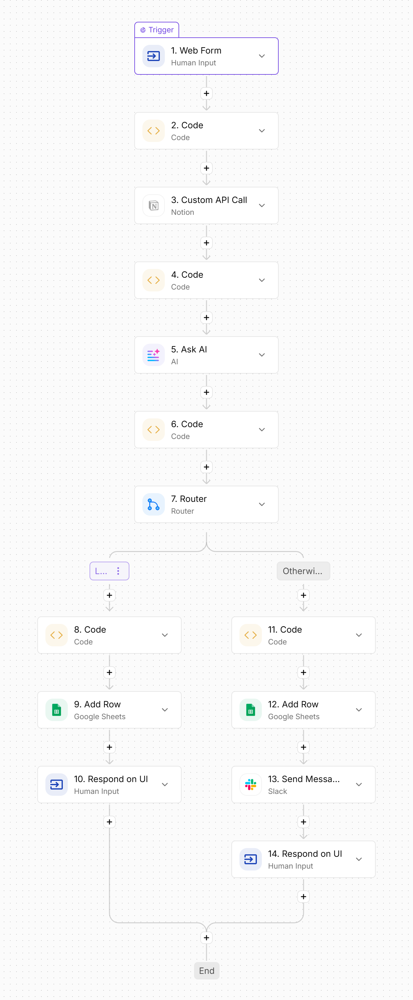

# Alia — AI Customer Support Agent

**[Live demo →](https://srinatha24.github.io/Alia-SupportAgent/)**

Alia is a customer support agent that answers product questions from a
knowledge base, escalates to a human when it's unsure or the customer
sounds frustrated, and holds a natural conversation for everything else —
greetings, small talk, and general questions it isn't meant to guess at.

Built as an ActivePieces flow, backed by a 100-entry Notion knowledge base,
with a custom chat frontend on top.

## What it does

- Answers support questions using a categorized knowledge base (Account,
  Billing, Shipping, Technical, Security, Integrations, Plans, General)
- Handles casual conversation and typos naturally, without forcing every
  message through the knowledge base
- Escalates to a human via Slack when confidence is low, the knowledge
  base has no answer, or the customer sounds frustrated or angry
- Logs every interaction (question, category, answer, confidence,
  sentiment, escalation status) to Google Sheets
- Responds live through a custom chat interface, not just ActivePieces'
  built-in form

## Architecture

```
Web Form (question)
      │
      ▼
Classify Category (keyword match → Account / Billing / Shipping / ...)
      │
      ▼
Notion API Call (filtered to matching category, or all results as fallback)
      │
      ▼
Format Knowledge Base (Code step → plain text Q&A block)
      │
      ▼
Ask AI (Claude — returns structured JSON: answer, confidence, sentiment,
        escalate, reason)
      │
      ▼
Parse Response (Code step → extracts fields, strict JSON parsing with
                a safe fallback if parsing fails)
      │
      ▼
Router (escalate?)
   ├── false → Log to Sheet → Respond with the real answer
   └── true  → Log to Sheet → Slack alert to a human → Respond with
                                                          an escalation notice
```



## Key design decisions

**Category filtering instead of dumping the whole KB into every prompt.**
At 100 entries, sending everything to the model on every call is slow and
wastes tokens. A lightweight keyword classifier runs first and filters the
Notion query to the matching category (falling back to "fetch everything"
if nothing matches), so each AI call only sees the ~10-15 relevant entries.

**Structured JSON output, not free text.** The Ask AI step is prompted to
return `{answer, confidence, sentiment, escalate, reason}` as strict JSON.
This makes the escalation decision explicit and machine-checkable, instead
of trying to infer intent from prose.

**Escalation is a judgment call, not just "no KB match."** The prompt
escalates on low confidence *or* detected frustration/anger — a customer
can ask something the KB technically covers and still get routed to a
human if they sound upset enough that a template answer wouldn't land
well.

**Hybrid chat + support behavior.** Early versions of this agent applied
the "answer using ONLY the knowledge base" instruction to every message,
which made greetings and small talk feel robotic. The prompt now
distinguishes casual conversation (answered naturally, never escalated)
from product questions (answered from the KB, escalated when unclear).

**Synchronous response delivery.** The web form trigger has "wait for
response" enabled, so the flow's output is returned directly in the HTTP
response — this is what lets the custom frontend show a real answer
instead of a generic "received" message.

## Frontend

A single-file HTML/CSS/JS chat interface (no build step) that posts
directly to the flow's webhook and renders the response as a chat bubble.
Alia's replies are styled like support ticket stubs — a green edge means
answered directly, amber means it was routed to a specialist. That status
is inferred from the reply text on the frontend, since the sync webhook
response doesn't expose the raw `escalate` flag directly; the authoritative
record of every escalation lives in the Google Sheets log.

## Files

| File | What it is |
|---|---|
| `SupportAgent.json` | Exported ActivePieces flow |
| `knowledge_base.csv` | The support knowledge base (100 Q&A entries, 8 categories) |
| `index.html` | The chat frontend |

## Running it yourself

1. Import `SupportAgent.json` into ActivePieces
2. Import `knowledge_base.csv` into a Notion database with `Name`,
   `Content`, and `Category` properties
3. Connect your Notion, AI provider, Slack, and Google Sheets accounts in
   the flow
4. Publish the flow and grab its webhook URL
5. Update the `WEBHOOK_URL` constant at the top of `index.html`
6. Open `index.html` in a browser, or deploy it as a static site

## What I'd add next

- Swap keyword-based category filtering for embedding-based retrieval as
  the knowledge base grows past a few hundred entries
- Expose the `escalate` flag directly in the webhook response instead of
  inferring it from reply text on the frontend
- Conversation memory across a session, so follow-up questions have context
